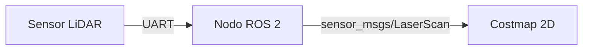

# Guía de contribución y buenas prácticas técnicas — Dronkab

Este repositorio aloja la memoria técnica, arquitectura de sistemas y procedimientos operativos de **Dronkab**. La documentación se gestiona bajo la filosofía *Docs-as-Code* (documentación tratada como código fuente), sujeta a estándares de calidad, control de versiones y revisión técnica.

---

## 1. Seguridad y repositorio público

Dado que este repositorio es de acceso público:

* **Cero credenciales en el código:** Queda estrictamente prohibido subir tokens personales de GitHub (`ghp_...`), contraseñas, llaves SSH privadas, direcciones IP de infraestructura cerrada o datos personales sensibles.
* **Segregación de información estratégica:** Este portal documenta *métodos de ingeniería, configuraciones de software, principios físicos y procedimientos de prueba*. No deben subirse pesos finales de modelos de inteligencia artificial en competencia activa, tácticas de vuelo confidenciales ni planos CAD de diseños no registrados.
* **Privacidad de identidad:** Configura tu cliente de Git para utilizar la dirección de correo protegida proporcionada por GitHub si deseas mantener privado tu correo personal:
```bash
git config --global user.name "Tu Nombre o Alias Profesional"
git config --global user.email "ID+usuario@users.noreply.github.com"

```


---

## 2. Estructura de ramas del equipo

Para facilitar el flujo de trabajo y reducir la fricción operativa durante las fases de desarrollo, operamos con un modelo simplificado de dos ramas permanentes:

```text
[Trabajo local del integrante]
            │
            ▼ (git push directo)
   Rama: `develop`   <─── Mesa de trabajo / Taller activo (Pruebas y borradores)
            │
            ▼ (Pull Request por hito completado o revisión periódica)
   Rama: `main`      <─── Producción oficial (Despliegue automático a GitHub Pages)

```

1. **`develop` (Mesa de trabajo):** Rama común de colaboración. Todo el trabajo diario, redacción de borradores, pruebas técnicas y ajustes de documentación se realizan e integran directamente en esta rama.
2. **`main` (Producción oficial):** Reflejo del sitio público desplegado en GitHub Pages. Está protegida contra escritura directa. Solo recibe cambios desde `develop` mediante un *Pull Request* formal una vez que el módulo o sección ha sido validado localmente.

---

## 3. Estándar de mensajes de Commit (*Conventional Commits*)

Todo cambio debe registrarse con un mensaje claro, conciso y estructurado bajo el estándar de confirmaciones convencionales:

```text
<tipo>(<módulo o sección>): <descripción breve en minúsculas y presente>

```

### Tipos permitidos:

* **`docs`**: Adición o modificación directa de manuales, guías y textos en Markdown.
* **`feat`**: Nuevas extensiones, configuración de plugins de MkDocs o scripts del portal.
* **`fix`**: Corrección de erratas técnicas, enlaces caídos o fórmulas matemáticas rotas.
* **`chore`**: Mantenimiento general, actualización de dependencias (`requirements.txt`) o cambios en Git.
* **`ci`**: Modificaciones en los flujos de GitHub Actions (`.github/workflows/`).

### Ejemplos correctos:

* `docs(lidar): documentar protocolo uart y tasa de refresco`
* `docs(docker): anadir solucion al error de redireccion x11`
* `fix(math): corregir signos en matriz de transformacion`
* `chore(deps): actualizar version de mkdocs-material`

### Ejemplos no permitidos:

* ❌ `"cambios"`
* ❌ `"subiendo archivos"`
* ❌ `"arreglos"`
* ❌ `"actualizacion de hoy"`

---

## 4. Normas de estilo y redacción técnica

* **Claridad y rigor:** Explica primero el principio teórico o la justificación del sistema (*por qué*) y luego el procedimiento ordenado (*cómo*).
* **Diagramas como código (Mermaid.js):** Emplea bloques Mermaid para diagramas de flujo, arquitecturas de nodos ROS y máquinas de estados finitos, evitando capturas de pantalla estáticas:
```markdown



```

```


* **Renderizado matemático (MathJax):** Utiliza sintaxis LaTeX delimitada por `$` para expresiones en línea y `$$` para ecuaciones en bloque:
```markdown
$$
z = \sqrt{x^2 + y^2}
$$

```


* **Manejo de imágenes y medios:**
* Almacena las imágenes dentro de subcarpetas `img/` en la sección correspondiente (ejemplo: `docs/hardware_avionica/lidar/img/`).
* Usa formatos ligeros y optimizados (`.webp`, `.png` comprimido) de menos de 2 MB.
* Emplea siempre rutas relativas: ``.


* **Cajas de advertencia (*Admonitions*):** Utiliza bloques destacados para advertencias de seguridad física (baterías LiPo, hélices) o notas técnicas críticas:
```markdown
!!! danger "Seguridad operativa"
    Retira siempre las hélices antes de realizar pruebas de telemetría o calibración de motores en interiores.

```


---

## 5. Ciclo de trabajo diario

### Paso 1: Sincronizar la mesa de trabajo

Antes de comenzar a redactar o editar en tu computadora, actualiza tu copia local:

```bash
git checkout develop
git pull origin develop

```

### Paso 2: Ejecutar el servidor de previsualización local

Activa tu entorno virtual y levanta el compilador en vivo:

```bash
source venv/bin/activate  # En Windows: venv\Scripts\activate
mkdocs serve

```

Abre `[http://127.0.0.1:8000](http://127.0.0.1:8000)` en el navegador para revisar la renderización en tiempo real conforme guardas cambios.

### Paso 3: Confirmar y subir a la mesa de trabajo

Una vez verificada la ausencia de errores en la terminal:

```bash
git add .
git commit -m "docs(onboarding): estructurar guia de instalacion docker"
git push origin develop

```

### Paso 4: Promoción a producción (`main`)

Cuando un hito técnico, guía completa o conjunto de documentos esté terminado y listo para su difusión pública:

1. Ve al repositorio en GitHub.
2. Abre un **Pull Request** con origen en `develop` y destino en `main`.
3. Completa la lista de verificación del PR (verificación local previa, sin enlaces caídos, sin datos sensibles).
4. Tras la revisión y aprobación por parte de un compañero o líder de área, se realiza el *Merge*.
5. GitHub Actions compilará y actualizará el portal público en segundos.
