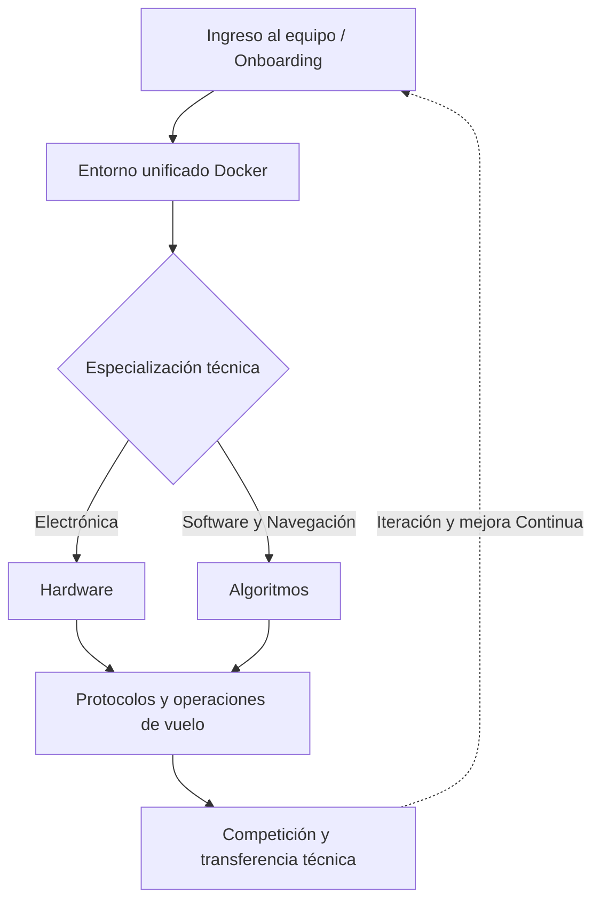

# Base de conocimiento y memoria técnica — Dronkab

Bienvenido al portal central de ingeniería, estandarización y memoria técnica del equipo representativo de drones autónomos **Dronkab**. 

Este espacio existe para resolver uno de los retos más críticos en las organizaciones tecnológicas y académicas: **la continuidad técnica intergeneracional**. Los proyectos, algoritmos y lecciones aprendidas en competencias no deben desvanecerse con el egreso de sus desarrolladores; deben convertirse en los cimientos sobre los cuales las siguientes generaciones construyan y superen los límites técnicos alcanzados.

---

---

## Filosofía operativa y principios técnicos

Toda labor técnica documentada y desarrollada en Dronkab se rige por cuatro principios fundamentales:

1. **Documentación como Código (*Docs-as-Code*):** Tratamos la documentación técnica con el mismo rigor y control de calidad que el software de vuelo. Nada se da por concluido hasta que sea reproducible por cualquier compañero mediante una guía paso a paso.
2. **Reproducibilidad y entornos contenerizados:** Minimizamos la fricción de configuración mediante contenedores Docker. El desarrollo algorítmico y de control debe ser idéntico en cualquier máquina de trabajo.
3. **Seguridad operativa ante todo:** La integridad física de los integrantes y del equipo prima sobre cualquier prueba. Ningún algoritmo vuela en hardware real sin antes haber sido validado en simulación y aprobado bajo listas de verificación (*checklists*).
4. **Aprender documentando y enseñar construyendo:** No se requiere dominar el 100% de una tecnología para comenzar a liderarla o estructurarla; el propio proceso de aprendizaje debe quedar registrado como un activo institucional para quienes lleguen después.

---

## Mapa de la base de Conocimiento

Navega a través de las diferentes secciones del portal según tu área de trabajo o nivel de incorporación:

| Módulo | Enfoque principal | Documentos clave |
| :--- | :--- | :--- |
| **Onboarding** | Configuración inicial y primeros pasos para nuevos miembros. | [Primeros Pasos](onboarding/primeros_pasos.md) • [Entorno Docker](onboarding/docker/entorno_docker.md) • [Flujo Git](onboarding/flujo_git.md) |
| **Hardware** | Distribución de potencia, integración electrónica y sensórica. | [Ejemplo](hardware/ejemplo_documento.md) • [Tecnología LiDAR](hardware/lidar/estadia_lidar.md) |
| **Algoritmos** | Arquitectura en ROS 2, algoritmos de navegación y control PX4. | [Ejemplo](algoritmos/ejemplo_documento.md)|
| **Operaciones** | Procedimientos de seguridad de campo y listas pre-vuelo. | [Checklist pre-vuelo](operaciones/checklist_vuelo.md) |

---

## ¿Acabas de integrarte al equipo?

!!! tip "Ruta crítica para nuevos integrantes"
    Si es tu primera semana en Dronkab, no intentes abarcar toda la documentación de golpe. Tu ruta de inicio recomendada es:
    
    1. Lee la guía de [primeros pasos en Dronkab](onboarding/primeros_pasos.md).
    2. Levanta tu entorno de desarrollo siguiendo el manual del [Entorno Docker](onboarding/docker/entorno_docker.md).
    3. Revisa la [guía de flujo Git](onboarding/flujo_git.md) antes de realizar tu primera contribución.
