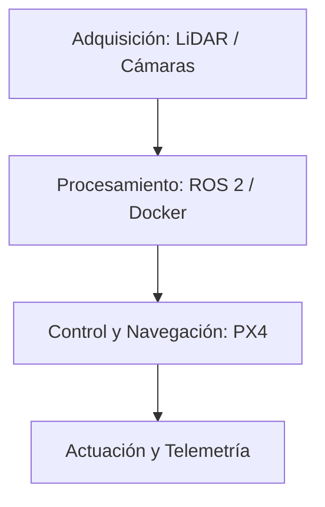

# Portal Técnico Dronkab

Bienvenido al repositorio central de documentación, estandarización y memoria técnica de Dronkab.

!!! info "Estado de la infraestructura"
    Este sitio web se compila automáticamente mediante integración continua (CI/CD) utilizando Markdown como estándar técnico.

## Verificación de renderizado de diagramas

## Verificación de fórmulas matemáticas

$$
f(x) = \frac{1}{\sigma \sqrt{2\pi}} e^{-\frac{1}{2}\left(\frac{x-\mu}{\sigma}\right)^2}
$$

## Ejes de desarrollo inmediato

- **Entorno de desarrollo estandarizado:** Despliegue de contenedores Docker para algoritmos de vuelo y visión artificial.
- **Percepción y navegación:** Caracterización, protocolos e integración de tecnología LiDAR.
- **Onboarding generacional:** Guías reproducibles para la incorporación de nuevos integrantes al equipo.