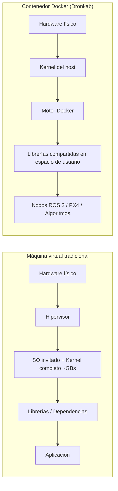
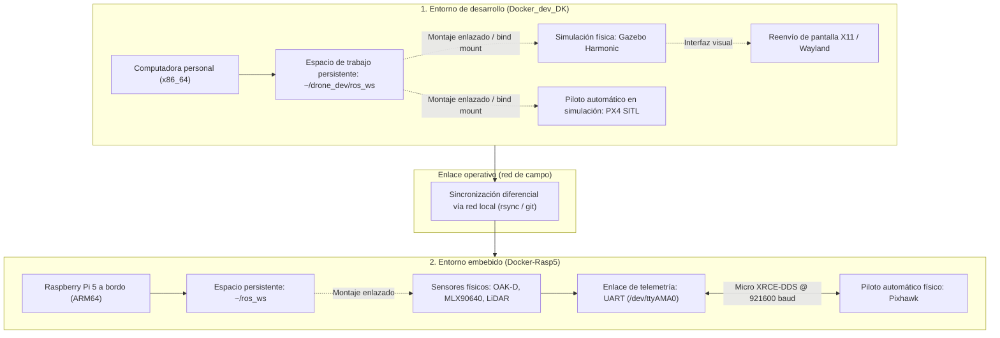

# Visión general del ecosistema Docker en Dronkab

El desarrollo de software para drones autónomos involucra múltiples capas tecnológicas: controladores de bajo nivel, estimadores de estado, algoritmos de navegación probabilística, visión computacional y modelos físicos de simulación[cite: 1, 2]. Históricamente, coordinar estas herramientas generaba el problema clásico de configuración conocido como «en mi máquina sí compila». 

Para erradicar la disparidad entre computadoras personales y garantizar que el código validado en simulación se ejecute de manera determinista en el hardware de vuelo[cite: 1, 2], Dronkab adopta la contenedorización como estándar de infraestructura.

---

## 1. ¿Qué es un contenedor y por qué se utiliza en robótica?

Un contenedor es una unidad ligera y autónoma de software que encapsula el código fuente, las librerías del sistema, los compiladores y las configuraciones de red requeridas para una tarea específica, compartiendo el núcleo (*kernel*) del sistema operativo anfitrión.

### Diferencias técnicas clave frente a máquinas virtuales
* **Rendimiento casi nativo:** Al no emular hardware completo ni ejecutar un segundo núcleo de sistema operativo en paralelo, los contenedores ofrecen acceso directo a memoria, procesador e interfaces de comunicación[cite: 3].
* **Determinismo de compilación:** Todo el equipo comparte exactamente la misma versión de compilador (GCC), versiones de Python y librerías de álgebra lineal (como Eigen)[cite: 2].
* **Aislamiento higiénico:** Tu computadora personal no requiere configuraciones invasivas que alteren las variables de entorno de tu sistema operativo diario.

---

## 2. Justificación técnica y arquitectura dual

En robótica aérea competitiva, una sola computadora no puede resolver simultáneamente la simulación visual pesada y la ejecución en tiempo real dentro del dron[cite: 2, 3]. Por ello, Dronkab implementa un modelo de arquitectura dividida en dos contenedores especializados[cite: 2, 3]:

### Funciones asignadas a cada entorno
1. **Entorno de desarrollo (`Docker_dev_DK`):** Se enfoca en la iteración rápida de algoritmos, visualización en interfaces gráficas (RViz2) y simulación dinámica de mundos y cámaras con Gazebo Harmonic y PX4 SITL[cite: 2].
2. **Entorno de despliegue a bordo (`Docker-Rasp5`):** Diseñado sin componentes gráficos innecesarios (*headless*), optimizado para bajo consumo de memoria RAM y enlace directo con buses de hardware (I2C, UART, USB)[cite: 3].

---

## 3. Requisitos del sistema

Antes de poner en marcha los entornos correspondientes, asegúrate de que el hardware y el sistema anfitrión cumplan con las siguientes características:

### Requisitos para la estación de desarrollo (tu computadora)[cite: 2]
* **Sistema operativo recomendado:** Ubuntu 22.04 LTS o Ubuntu 24.04 LTS nativo[cite: 2]. (También es compatible con Windows 11 utilizando WSL2 con backend de Ubuntu).
* **Procesador:** CPU multi-núcleo (mínimo 4 núcleos, recomendado 8 núcleos para reducir tiempos de compilación de PX4)[cite: 2].
* **Memoria RAM:** Mínimo 16 GB (la simulación simultánea de Gazebo, PX4 SITL y puentes de ROS 2 consume entre 8 y 12 GB de memoria de trabajo)[cite: 2].
* **Almacenamiento:** Mínimo 35 GB de espacio libre en disco para alojar imágenes base, código fuente de PX4 y caché de compilación (`ccache`)[cite: 2].
* **Tarjeta gráfica (opcional):** GPU NVIDIA con controladores propietarios instalados si se requiere aceleración de renderizado para múltiples cámaras simuladas[cite: 2].

### Requisitos para la computadora a bordo (aeronave)[cite: 3]
* **Hardware:** Placa monoplaca Raspberry Pi 5 (versión de 8 GB recomendada)[cite: 3].
* **Almacenamiento:** Unidad de estado sólido NVMe o tarjeta microSD clase A2/V30 de alta velocidad con disipación de calor activa.
* **Periféricos y buses:** Interfaces seriales y de comunicación habilitadas a nivel de kernel mediante `raspi-config` (`/dev/ttyAMA0` para Pixhawk e `/dev/i2c-1` para sensores auxiliares)[cite: 3].

---

## 4. Principios operativos de persistencia e higiene

Para evitar la pérdida involuntaria de trabajo o la degradación de los contenedores, el equipo se rige por las siguientes pautas técnicas:

### El código vive en el anfitrión, la compilación en el contenedor
Nunca guardes archivos fuente únicamente dentro del sistema de archivos interno del contenedor[cite: 2]. El código debe residir siempre en carpetas locales de tu máquina montadas mediante volúmenes enlazados (*bind mounts*)[cite: 2, 3]. Si el contenedor se elimina o se actualiza, tus archivos permanecen intactos en tu disco duro[cite: 2].

### Reproducibilidad declarativa
Queda prohibido utilizar el comando `docker commit` para generar nuevas imágenes a partir de contenedores modificados interactivamente. Cualquier cambio permanente de librerías o dependencias debe añadirse explícitamente en el archivo `Dockerfile` correspondiente y registrarse mediante control de versiones en Git[cite: 2, 3].

---

## 5. Rutas de implementación

Selecciona la guía detallada según la plataforma que requieras configurar:

| Guía técnica | Plataforma destino | Tecnologías integradas |
| :--- | :--- | :--- |
| **[Entorno de desarrollo (PC)](entorno_docker_dev.md)** | Estación de trabajo / Laptop | ROS 2 Jazzy, Gazebo Harmonic, PX4 SITL, Micro XRCE-DDS[cite: 2] |
| **[Entorno embebido (dron)](entorno_docker_dron.md)** | Raspberry Pi 5 a bordo | ROS 2 Jazzy, OAK-D, sensor térmico MLX90640, enlace Pixhawk[cite: 3] |

---

## 6. Documentación técnica oficial y referencias externas

Para profundizar en los fundamentos teóricos y comandos avanzados de las tecnologías que conforman este ecosistema, consulta las fuentes oficiales de referencia:

* [Documentación oficial de Docker Engine](https://docs.docker.com/engine/): Arquitectura de contenedores, redes y gestión de almacenamiento.
* [Documentación de ROS 2 Jazzy Jalisco](https://docs.ros.org/en/jazzy/): Sistema middleware de comunicación para robótica.
* [Guía de usuario de PX4 Autopilot](https://docs.px4.io/main/en/): Integración de control de vuelo, arquitectura uORB y modos offboard.
* [Documentación de Gazebo Harmonic](https://gazebosim.org/docs/harmonic/): Motor de física y simulación sensorial para sistemas autónomos.
* [Manual de Micro XRCE-DDS (eProsima)](https://micro-xrce-dds.docs.eprosima.com/): Protocolo ligero cliente-agente para microcontroladores y computadoras embebidas.
