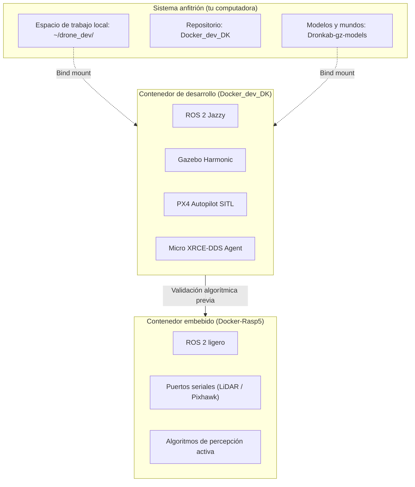

# Ecosistema de contenedores Docker en Dronkab

Para garantizar la reproducibilidad técnica en cualquier computadora y simplificar la transición del software hacia el hardware real, el equipo estandariza sus herramientas mediante contenedores Docker[cite: 1, 2]. 

En lugar de mantener un único entorno monolítico, Dronkab opera bajo una arquitectura modular donde cada contenedor atiende un propósito de ingeniería específico: desarrollo y simulación en computadoras personales (`Docker_dev_DK`)[cite: 2], ejecución en computadoras de vuelo a bordo (`Docker-Rasp5`), y futuros entornos dedicados de procesamiento de datos o pruebas en lazo cerrado (*software-in-the-loop*).



---

## 1. Arquitectura del espacio de trabajo en el sistema anfitrión

Para que las compilaciones y el código sobrevivan a la recreación de contenedores, todo el trabajo vive en una carpeta central en el sistema de archivos de tu computadora y se enlaza al contenedor mediante montajes directos (*bind mounts*)[cite: 2]:

```text
~/drone_dev/
├── Docker_dev_DK/          # Archivos de configuración del contenedor (Dockerfile, compose)
├── PX4-Autopilot/          # Código fuente de PX4 (se clona automáticamente)
├── ros_ws/                 # Espacio de trabajo de ROS 2 (paquetes y código propio)
│   └── src/
├── Dronkab-gz-models/       # Modelos 3D, mundos y sensores de Gazebo
└── .ccache/                # Caché persistente para acelerar recompilaciones de C++
```

| Ruta en tu computadora | Punto de montaje interno | Propósito técnico |
| :--- | :--- | :--- |
| `~/drone_dev/PX4-Autopilot` | `/px4/PX4-Autopilot` | Código fuente de PX4 enlazado; permite cambiar de versión sin reconstruir la imagen[cite: 2]. |
| `~/drone_dev/ros_ws` | `/ros_ws` | Directorio de trabajo para nodos y algoritmos[cite: 2]. |
| `~/drone_dev/Dronkab-gz-models` | `/gz_assets` | Modelos de drones, arenas y texturas para simulación[cite: 2]. |
| `~/drone_dev/.ccache` | `/home/DronKab/.ccache` | Caché de compilación compartida entre sesiones de trabajo[cite: 2]. |

---

## 2. Preparación inicial del sistema anfitrión (Ubuntu)

Para instalar el motor oficial de Docker y configurar los permisos necesarios sin requerir privilegios de superusuario (`sudo`) en cada ejecución[cite: 2]:

### 2.1 Desinstalación de paquetes previos y configuración de repositorios
```bash
# Limpiar paquetes genéricos previos
sudo apt remove -y docker docker-engine docker.io containerd runc

# Instalar certificados y llaves oficiales
sudo apt update
sudo apt install -y ca-certificates curl gnupg
sudo install -m 0755 -d /etc/apt/keyrings
curl -fsSL [https://download.docker.com/linux/ubuntu/gpg](https://download.docker.com/linux/ubuntu/gpg) | sudo gpg --dearmor -o /etc/apt/keyrings/docker.gpg
sudo chmod a+r /etc/apt/keyrings/docker.gpg

# Agregar el repositorio estable de Docker
echo "deb [arch=$(dpkg --print-architecture) signed-by=/etc/apt/keyrings/docker.gpg] [https://download.docker.com/linux/ubuntu](https://download.docker.com/linux/ubuntu) $(. /etc/os-release && echo $VERSION_CODENAME) stable" | sudo tee /etc/apt/sources.list.d/docker.list > /dev/null
```

### 2.2 Instalación del motor y adición al grupo de usuarios
```bash
sudo apt update
sudo apt install -y docker-ce docker-ce-cli containerd.io docker-buildx-plugin docker-compose-plugin

# Asignar usuario al grupo docker
sudo usermod -aG docker $USER
newgrp docker
```

---

## 3. Puesta en marcha de `Docker_dev_DK`

!!! note "Acceso a repositorios internos"
    `Docker_dev_DK` y `Dronkab-gz-models` son repositorios de desarrollo alojados dentro de la organización de GitHub del equipo. Requieren permisos de colaborador activo para su clonación.

### 3.1 Creación de carpetas y descarga de repositorios
Prepara la estructura de carpetas en tu terminal local[cite: 2]:

```bash
mkdir -p ~/drone_dev/ros_ws/src
mkdir -p ~/drone_dev/PX4-Autopilot
mkdir -p ~/drone_dev/.ccache
cd ~/drone_dev

# Clonar los repositorios de trabajo
git clone [https://github.com/Dronkab/Docker_dev_DK.git](https://github.com/Dronkab/Docker_dev_DK.git)
git clone [https://github.com/Dronkab/Dronkab-gz-models.git](https://github.com/Dronkab/Dronkab-gz-models.git)
```

### 3.2 Selección de versión de PX4 mediante variables de entorno
La versión de PX4 se gestiona de forma desacoplada sin modificar el archivo de construcción[cite: 2]:

```bash
cd ~/drone_dev/Docker_dev_DK
cp .env.example .env
```

Edita `.env` para fijar la versión según los requerimientos de la prueba[cite: 2]:
* **`v1.14.3`:** Versión estable para vuelos de lógica de control enlazados con jMAVSim[cite: 2].
* **`release/1.16` o superior:** Versión requerida para simulaciones con Gazebo Harmonic (cámaras RGB, sensores de profundidad y LiDAR)[cite: 2].

### 3.3 Construcción y arranque del contenedor
```bash
# Permitir que el contenedor acceda al servidor gráfico del sistema anfitrión
xhost +local:docker

# Construir y levantar el contenedor en segundo plano
docker compose build
docker compose up -d
```

*(En el primer arranque, el contenedor descargará el código fuente de PX4 directamente en el volumen persistente[cite: 2]. El avance puede monitorearse con `docker compose logs -f drone`)[cite: 2].*

---

## 4. Flujo de trabajo y atajos de desarrollo

Con el contenedor activo en segundo plano, se recomienda trabajar abriendo terminales independientes para cada proceso[cite: 2]:

```bash
# Terminal 1: Simulación de vuelo y física (Gazebo)
docker compose exec drone px4_gz

# Terminal 2: Agente de comunicación DDS
docker compose exec drone xrce

# Terminal 3: Compilación y ejecución de nodos de ROS 2
docker compose exec drone bash
cd /ros_ws
cb
