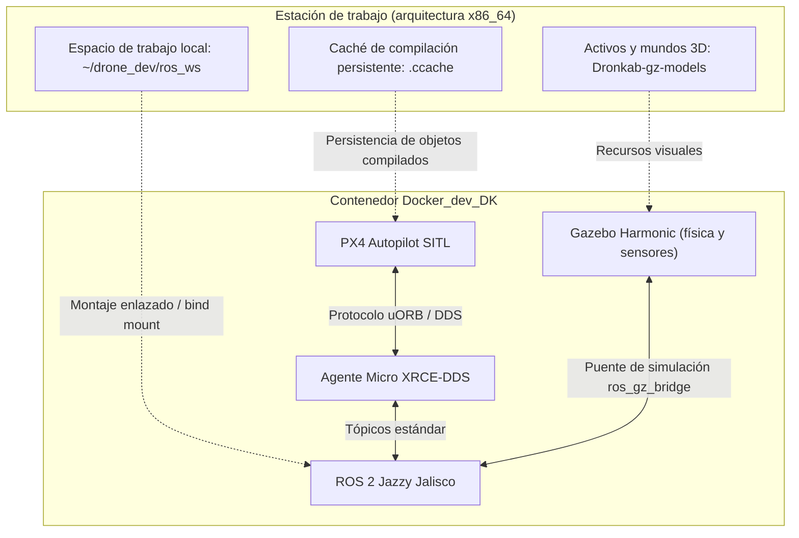

# Entorno de desarrollo y simulación (Docker_dev_DK)

En robótica aérea autónoma, la estación de desarrollo personal cumple el rol de laboratorio virtual: permite diseñar la lógica de navegación, procesar flujos de percepción y validar misiones completas mediante simulación en lazo cerrado (*software-in-the-loop* o SITL) antes de interactuar con una aeronave física[cite: 2].

El módulo `Docker_dev_DK` encapsula esta cadena de diseño en un entorno estandarizado sobre Ubuntu 24.04, mitigando discrepancias de compilación entre los integrantes del equipo y aislando dependencias complejas del sistema operativo anfitrión[cite: 1, 2].

---

## 1. Pila tecnológica y justificación técnica

La arquitectura de este entorno integra cuatro pilares del desarrollo moderno en robótica móvil[cite: 2]:

* **ROS 2 Jazzy Jalisco:** Distribución de soporte extendido utilizada como intermediario (*middleware*) para la suscripción y publicación de tópicos sensoriales, odometría, servicios y acciones de control[cite: 2].
* **PX4 Autopilot (modo SITL):** Firmware de control de vuelo compilado de forma nativa para ejecutarse como un proceso en la computadora[cite: 2]. Emula la dinámica de vuelo, los lazos de control proporcional-integral-derivativo (PID) y el estimador de estado (EKF2) sin depender de hardware físico[cite: 2].
* **Gazebo Harmonic:** Motor de simulación de física rígida, colisiones e iluminación, responsable de emular el comportamiento de actuadores y renderizar la información de sensores complejos (cámaras de visión espacial, mapas de profundidad y sensores de rango)[cite: 2].
* **Micro XRCE-DDS:** Agente de comunicación ligero de alto rendimiento que conecta el bus de mensajería interna del piloto automático (uORB) con el grafo distribuido de ROS 2 a través de sockets de red UDP[cite: 2].

---

## 2. Principios de arquitectura y persistencia

Para asegurar que el flujo de trabajo sea eficiente, flexible e higiénico, el diseño de este contenedor se rige por tres directrices[cite: 2]:

### Desacoplamiento del código fuente (*bind mounts*)
El contenedor no almacena código fuente dentro de su propia imagen[cite: 2]. Los directorios de trabajo —como los paquetes de ROS 2, los modelos tridimensionales y el código base del piloto automático— se montan en tiempo de ejecución desde el sistema anfitrión[cite: 2]. Esto garantiza que cualquier modificación persista en la máquina del desarrollador aunque el contenedor sea eliminado o reconstruido[cite: 2].

### Independencia de versiones de firmware
El código de PX4 no se encuentra congelado de forma estática en la imagen base[cite: 2]. El entorno permite cambiar de versión, rama o etiqueta de compilación mediante variables de entorno y volúmenes dedicados, permitiendo probar versiones estables de competencia junto a versiones recientes compatibles con motores de simulación avanzados[cite: 2].

### Aceleración gráfica y redirección de interfaz
Para visualizar la simulación física e inspeccionar nubes de puntos o mapas de ocupación mediante RViz2, el contenedor redirige la salida del servidor gráfico hacia el monitor anfitrión a través de sockets X11 o Wayland[cite: 1, 2]. Asimismo, está preparado para integrar aceleración de renderizado por hardware cuando la máquina anfitriona cuenta con procesadores gráficos dedicados[cite: 2].

---

## 3. Dinámica del flujo de trabajo

El ciclo habitual de desarrollo con este entorno sigue un proceso secuencial de validación progresiva[cite: 2]:

1. **Edición en espacio local:** El código se escribe desde el editor del sistema anfitrión dentro de la carpeta compartida del espacio de trabajo[cite: 2].
2. **Compilación incremental:** Se compilan exclusivamente los paquetes modificados utilizando cadenas de compilación compartidas y optimizadas mediante caché de objetos (`ccache`)[cite: 2].
3. **Simulación de lazo cerrado:** Se levantan simultáneamente el gemelo virtual del dron en Gazebo, el estimador de vuelo de PX4 y el puente de comunicación DDS[cite: 2].
4. **Verificación de interfaces:** Se analiza la consistencia de los mensajes uORB/ROS 2 para confirmar que las transformadas de coordenadas, frecuencias de muestreo y comandos de posición respondan a las tolerancias requeridas antes de desplegar en la aeronave real[cite: 2].

---

## 4. Acceso y despliegue para miembros activos

Los archivos de definición técnica (`Dockerfile`, recetas de `docker compose`, scripts de aprovisionamiento y variables de entorno preconfiguradas) se encuentran alojados en el repositorio privado **`Docker_dev_DK`** dentro de la organización de GitHub del equipo[cite: 2]. 

Los integrantes activos que requieran desplegar esta herramienta deben solicitar asignación de permisos al líder de área y remitirse a la guía de inicio contenida en el `README.md` interno de dicho repositorio para la configuración inicial de variables locales[cite: 2].

---

## 5. Referencias y fuentes de consulta

Para profundizar en los principios teóricos y el uso avanzado de las tecnologías que conforman esta plataforma, consulta los siguientes recursos:

* [Manual de simulación SITL en PX4 Autopilot](https://docs.px4.io/main/en/simulation/): Conceptos de simulación de dinámicas de vuelo y lazos de control.
* [Guía de integración PX4 - ROS 2](https://docs.px4.io/main/en/ros2/user_guide.html): Protocolos uORB, Micro XRCE-DDS y estructura de mensajes.
* [Documentación de Gazebo Harmonic](https://gazebosim.org/docs/harmonic/): Creación de mundos virtuales, definición de modelos SDF y simulación sensorial.
* [Documentación oficial de ROS 2 Jazzy](https://docs.ros.org/en/jazzy/): Arquitectura de nodos, gestión de espacios de trabajo y compilación con Colcon.
* [NVIDIA Container Toolkit Architecture](https://docs.nvidia.com/datacenter/cloud-native/container-toolkit/latest/index.html): Principios de exposición de controladores y aceleración de cómputo en contenedores.
