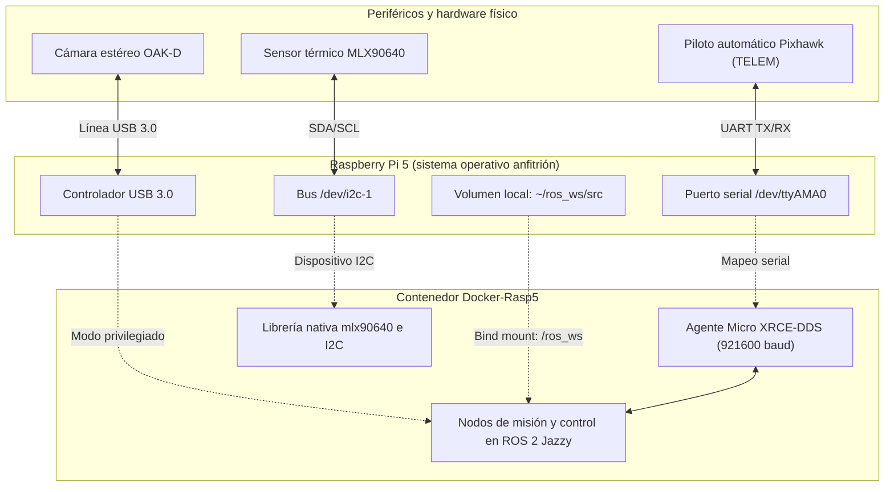

# Entorno embebido en Raspberry Pi 5 (Docker-Rasp5)

El contenedor `Docker-Rasp5` constituye la plataforma de despliegue y ejecución en tiempo real montada sobre la computadora a bordo del dron (Raspberry Pi 5)[cite: 3]. Su propósito principal es desacoplar las dependencias de bajo nivel del sistema operativo anfitrión, comunicarse con el piloto automático Pixhawk mediante el enlace serial UART y gestionar la adquisición directa de los sensores físicos: la cámara espacial OAK-D y la cámara térmica infrarroja MLX90640[cite: 3].



---

## 1. Estructura interna del repositorio

El repositorio de despliegue a bordo mantiene una estructura minimalista para reducir la sobrecarga de compilación en arquitecturas ARM64[cite: 3]:

```text
raspberry_docker/
├── Dockerfile.raspberry            # Definición de capas base (ROS 2 Jazzy + dependencias OAK-D y MLX90640)
├── docker-compose.raspberry.yml    # Orquestación con mapeo de pines, dispositivos e interfaces
├── entrypoint.raspberry.sh         # Script de inicio con diagnóstico automático de sensores
├── bashrc_extras.raspberry         # Configuración de entorno y aliases de terminal
└── README.md
```

El código fuente de tus paquetes y algoritmos no vive dentro de esta carpeta, sino en un directorio independiente en el sistema anfitrión de la Raspberry Pi (`~/ros_ws`)[cite: 3], el cual se monta automáticamente como volumen compartido hacia `/ros_ws` dentro del contenedor[cite: 3].

---

## 2. Requisitos previos en la Raspberry Pi 5

Antes de iniciar el contenedor, es indispensable habilitar el motor Docker y activar los buses de comunicación del procesador BCM2712 a nivel de firmware[cite: 3].

### 2.1 Instalación de Docker Engine
Conéctate por terminal a la Raspberry Pi y ejecuta la instalación del motor oficial[cite: 3]:

```bash
sudo apt update
sudo apt install -y ca-certificates curl gnupg

sudo install -m 0755 -d /etc/apt/keyrings
curl -fsSL [https://download.docker.com/linux/ubuntu/gpg](https://download.docker.com/linux/ubuntu/gpg) | sudo gpg --dearmor -o /etc/apt/keyrings/docker.gpg
sudo chmod a+r /etc/apt/keyrings/docker.gpg

echo "deb [arch=$(dpkg --print-architecture) signed-by=/etc/apt/keyrings/docker.gpg] [https://download.docker.com/linux/ubuntu](https://download.docker.com/linux/ubuntu) $(. /etc/os-release && echo $VERSION_CODENAME) stable" | sudo tee /etc/apt/sources.list.d/docker.list > /dev/null

sudo apt update
sudo apt install -y docker-ce docker-ce-cli containerd.io docker-buildx-plugin docker-compose-plugin

# Permitir el uso de Docker sin privilegios de superusuario
sudo usermod -aG docker $USER
newgrp docker
```

### 2.2 Activación del bus I2C
El bus I2C es necesario para interrogar la matriz del sensor térmico MLX90640[cite: 3]:

1. Ejecuta la herramienta de configuración del sistema[cite: 3]:
   ```bash
   sudo raspi-config
   ```
2. Navega a **Interface Options** $\rightarrow$ **I2C** $\rightarrow$ selecciona **Enable**[cite: 3].
3. Reinicia la placa con `sudo reboot`[cite: 3].
4. Comprueba que el archivo de dispositivo exista en el sistema de archivos[cite: 3]:
   ```bash
   ls /dev/i2c*
   # La salida esperada debe incluir: /dev/i2c-1
   ```

### 2.3 Activación del puerto serial UART para Pixhawk
El puerto serial permite el intercambio de mensajes uORB/ROS 2 a alta velocidad entre la Raspberry Pi y la controladora de vuelo[cite: 3]:

1. Entra nuevamente a la configuración del sistema[cite: 3]:
   ```bash
   sudo raspi-config
   ```
2. Navega a **Interface Options** $\rightarrow$ **Serial Port**[cite: 3].
3. En la pregunta *«Would you like a login shell to be accessible over serial?»*, responde **No**[cite: 3].
4. En la pregunta *«Would you like the serial port hardware to be enabled?»*, responde **Yes**[cite: 3].
5. Guarda los cambios y reinicia la placa con `sudo reboot`[cite: 3].
6. Confirma la presencia del dispositivo UART principal[cite: 3]:
   ```bash
   ls /dev/ttyAMA0
   ```

---

## 3. Conexionado físico de hardware

La correcta asignación de pines en la regleta GPIO de 40 pines de la Raspberry Pi 5 previene daños eléctricos y asegura la comunicación síncrona con los sensores[cite: 3].

### 3.1 Sensor térmico MLX90640 (comunicación I2C)[cite: 3]
Este sensor opera a una tensión lógica de 3.3 V[cite: 3]. Conéctalo siguiendo la siguiente distribución de pines[cite: 3]:

| Pin del sensor MLX90640 | Pin físico Raspberry Pi 5 | Función de hardware |
| :--- | :--- | :--- |
| **VCC** | Pin 1 | Alimentación de 3.3 V[cite: 3] |
| **GND** | Pin 6 | Conexión a tierra de referencia[cite: 3] |
| **SDA** | Pin 3 | Datos I2C (GPIO 2)[cite: 3] |
| **SCL** | Pin 5 | Reloj I2C (GPIO 3)[cite: 3] |

Para verificar que el cableado es correcto antes de inicializar Docker, corre en el anfitrión[cite: 3]:
```bash
sudo apt install -y i2c-tools
i2cdetect -y 1
```
El dispositivo debe responder de forma visible en la dirección hexadecimal **`0x33`** dentro de la matriz de escaneo[cite: 3].

### 3.2 Enlace de telemetría Pixhawk (puerto UART)[cite: 3]
Conecta las líneas cruzadas entre el conector TELEM de la Pixhawk y los pines UART correspondientes de la Raspberry Pi[cite: 3]:

| Pin Raspberry Pi 5 | Puerto TELEM de Pixhawk | Descripción del enlace |
| :--- | :--- | :--- |
| **Pin 8 (GPIO 14 / TX)** | TELEM RX | Transmisión de datos hacia la controladora[cite: 3] |
| **Pin 10 (GPIO 15 / RX)** | TELEM TX | Recepción de telemetría desde la controladora[cite: 3] |
| **Pin 6 (GND)** | GND | Tierra común de señal[cite: 3] |

!!! warning "Aseguramiento de voltajes lógicos"
    No conectes bajo ninguna circunstancia los pines de 5 V de la Pixhawk a los pines GPIO de la Raspberry Pi 5. Utiliza únicamente las líneas TX, RX y GND. La alimentación de la Raspberry Pi 5 debe provenir de un regulador independiente capaz de entregar 5 V a 5 A vía USB-C o pines dedicados.

---

## 4. Puesta en marcha rápida

### Paso 1: Preparación del espacio de trabajo
Crea la carpeta de trabajo donde se montarán los paquetes de ROS 2[cite: 3]:
```bash
mkdir -p ~/ros_ws/src
```

### Paso 2: Clonación del repositorio y compilación de la imagen
Descarga los archivos de despliegue en la Raspberry Pi y levanta el servicio[cite: 3]:
```bash
git clone git@github.com:Dronkab/raspberry_docker.git
cd raspberry_docker

# Construir la imagen para arquitectura ARM64
docker compose -f docker-compose.raspberry.yml build

# Iniciar el contenedor en segundo plano
docker compose -f docker-compose.raspberry.yml up -d
```

### Paso 3: Acceso interactivo y diagnóstico automático
Ingresa a la línea de comandos del contenedor en ejecución[cite: 3]:
```bash
docker compose -f docker-compose.raspberry.yml exec drone-rpi bash
```

Al abrir la terminal, el script de inicialización (`entrypoint`) evaluará el estado de los buses y sensores conectados, imprimiendo un reporte de estado[cite: 3]:
```text
[entrypoint] ✓ ros_ws workspace cargado
[entrypoint] ✓ UART disponible en /dev/ttyAMA0
[entrypoint] ✓ I2C bus 1 disponible
[entrypoint] ✓ MLX90640 detectado en 0x33
[entrypoint] ✓ OAK-D detectado
```

Si alguno de estos componentes presenta una marca de error, revisa las conexiones físicas y las variables del archivo `docker-compose.raspberry.yml` antes de intentar volar[cite: 3].

---

## 5. Sincronización y flujo operativo de vuelo

Durante las jornadas de prueba o competencia, no se recomienda editar código fuente directamente sobre la Raspberry Pi[cite: 3]. El ciclo operativo estándar consiste en sincronizar los cambios desde tu estación de trabajo y ejecutar el control en dos terminales SSH concurrentes[cite: 3]:

### 5.1 Transferencia de código desde la computadora de desarrollo
Desde la terminal de tu laptop (dentro del entorno de desarrollo), ejecuta `rsync` para copiar únicamente los archivos fuente hacia el espacio montado en la aeronave[cite: 3]:

```bash
rsync -av --exclude='build/' --exclude='install/' --exclude='log/' \
    ~/drone_dev/ros_ws/src/ \
    dronkab@<IP_DEL_DRON>:~/ros_ws/src/
```

### 5.2 Ejecución operativa en dos terminales
Abre dos sesiones independientes vía SSH hacia la Raspberry Pi e ingresa al contenedor en ambas[cite: 3]:

```bash
ssh dronkab@<IP_DEL_DRON>
docker compose -f docker-compose.raspberry.yml exec drone-rpi bash
```

* **Terminal 1 (Puente DDS con Pixhawk):**
  Inicia el agente Micro XRCE-DDS configurado para el puerto serial UART con una tasa de baudios de 921600[cite: 3]:
  ```bash
  xrce
  ```
  *(Este comando ejecuta internamente: `MicroXRCEAgent serial --dev /dev/ttyAMA0 -b 921600`)[cite: 3].*

* **Terminal 2 (Compilación y lanzamiento de nodos):**
  Compila el código recién transferido e inicia el nodo o archivo de lanzamiento (*launch file*) de la misión[cite: 3]:
  ```bash
  cd /ros_ws
  cb                                        # colcon build --symlink-install
  ros2 launch tu_paquete tu_launch.py
  ```

---

## 6. Integración del sensor MLX90640 en nodos C++

El contenedor cuenta con la librería de bajo nivel del sensor preinstalada en la ruta del sistema `/usr/local`[cite: 3]. Para utilizarla dentro de un paquete personalizado de ROS 2, declara las cabeceras y enlaces correspondientes:

### En el archivo `CMakeLists.txt`[cite: 3]
```cmake
find_package(ament_cmake REQUIRED)
find_package(rclcpp REQUIRED)

# Incluir las cabeceras preinstaladas en el contenedor
target_include_directories(tu_nodo PRIVATE /usr/local/include)

# Vincular las librerías dinámicas del sensor y del bus I2C
target_link_libraries(tu_nodo mlx90640 i2c)
```

### En el código fuente C++ (`src/tu_nodo.cpp`)[cite: 3]
```cpp
#include "rclcpp/rclcpp.hpp"
#include "mlx90640_api.h"

// El sensor genera una matriz de 32 x 24 puntos de temperatura
float frame[768];
paramsMLX90640 params;

// Adquisición de la trama térmica cruda y conversión radiométrica
MLX90640_GetFrameData(0x33, rawFrame);
MLX90640_CalculateTo(rawFrame, &params, emissivity, tr, frame);
```

---

## 7. Comandos de acceso rápido (aliases)

Dentro de la sesión interactiva del contenedor se encuentran definidos los siguientes atajos de terminal[cite: 3]:

| Alias | Comando nativo | Propósito técnico |
| :--- | :--- | :--- |
| `cb` | `colcon build --symlink-install` | Compila el espacio de trabajo completo preservando enlaces simbólicos[cite: 3]. |
| `cbs <paquete>` | `colcon build --packages-select <paquete>` | Compila de forma acelerada únicamente el paquete indicado[cite: 3]. |
| `cs` | `source /ros_ws/install/setup.bash` | Carga las variables y nodos del espacio local de ROS 2[cite: 3]. |
| `xrce` | `MicroXRCEAgent serial --dev /dev/ttyAMA0 -b 921600` | Inicia el intermediario DDS por enlace UART con el piloto automático[cite: 3]. |
| `uart` | `picocom -b 921600 /dev/ttyAMA0` | Abre un monitor serial interactivo directo hacia la consola de PX4[cite: 3]. |

---

## 8. Diagnóstico y solución de incidencias recurrentes

| Síntoma observado | Causa técnica probable | Solución operativa |
| :--- | :--- | :--- |
| No existe el archivo de dispositivo `/dev/i2c-1`[cite: 3]. | El bus I2C se encuentra deshabilitado en la configuración del procesador[cite: 3]. | Ejecuta `sudo raspi-config` en el anfitrión, habilita la interfaz I2C y reinicia la placa[cite: 3]. |
| El sensor MLX90640 no aparece al correr `i2cdetect`[cite: 3]. | Cableado incorrecto o alimentación fuera de rango[cite: 3]. | Revisa que SDA esté en pin 3, SCL en pin 5 y que la alimentación sea estrictamente de 3.3 V (pin 1)[cite: 3]. |
| No existe el archivo de dispositivo `/dev/ttyAMA0`[cite: 3]. | El hardware UART serial no ha sido asignado al sistema de archivos[cite: 3]. | Habilita el puerto serial en `raspi-config` sin consola de login y reinicia la placa[cite: 3]. |
| Micro XRCE-DDS no logra sincronizar con Pixhawk[cite: 3]. | Desajuste en la tasa de baudios de la controladora[cite: 3]. | En QGroundControl, confirma que el parámetro de firmware `SER_TEL1_BAUD` esté fijado en `921600`[cite: 3]. |
| La cámara OAK-D no es detectada en el arranque[cite: 3]. | Falta de privilegios de bus USB o conexión en puerto USB 2.0[cite: 3]. | Conecta la cámara exclusivamente a un puerto USB 3.0 (puerto azul) y valida que el compose tenga `privileged: true`[cite: 3]. |
