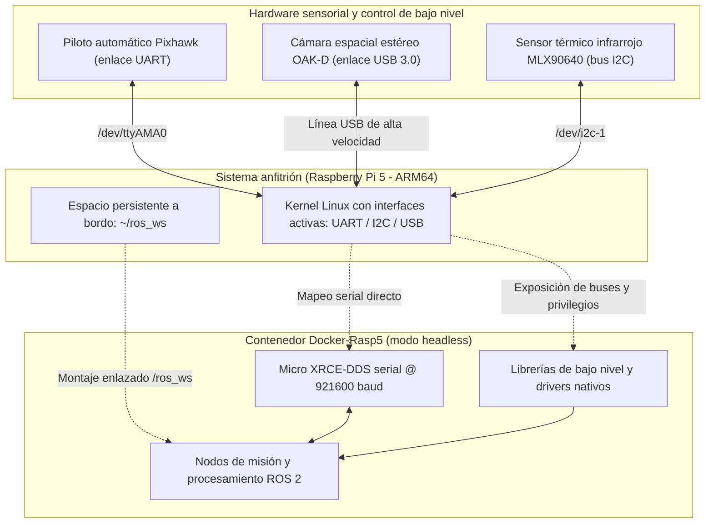

# Entorno embebido a bordo (Docker-Rasp5)

En sistemas aéreos no tripulados, la computadora a bordo —frecuentemente denominada computadora compañera (*companion computer*)— actúa como el cerebro de alto nivel del sistema[cite: 3]. Mientras la controladora de vuelo (como una Pixhawk) resuelve en microsegundos los lazos de estabilización, actitud y mezcla de motores, la computadora compañera asume el procesamiento de algoritmos pesados: adquisición visual, procesamiento de nubes de puntos, estimación de trayectorias y toma de decisiones tácticas[cite: 3].

El módulo `Docker-Rasp5` estandariza el entorno de ejecución sobre la arquitectura ARM64 de la Raspberry Pi 5 montada en el chasis del dron, proporcionando aislamiento operativo y acceso estructurado a los buses físicos de hardware[cite: 3].

---

## 1. Justificación y rol dentro de la aviónica

A diferencia del entorno de desarrollo de escritorio, el contenedor embebido opera bajo restricciones estrictas de peso computacional y consumo energético[cite: 3]:

* **Ejecución sin interfaz gráfica (*headless*):** Prescinde por completo de servidores de visualización (X11/Wayland), librerías de renderizado o utilidades de simulación, destinando todos los núcleos del procesador BCM2712 y la memoria RAM exclusivamente a la ejecución de nodos y procesamiento sensorial[cite: 3].
* **Acceso directo a periféricos del procesador:** Configura permisos y mapeos para que el contenedor interactúe con los buses de comunicación del silicio: interfaz serial asíncrona (UART), bus de circuito inter-integrado (I2C) y controladores de bus serie universal (USB 3.0)[cite: 3].
* **Operación de alta velocidad en telemetría:** Alberga el cliente/agente de Micro XRCE-DDS configurado a tasas de transmisión elevadas (921600 baudios), permitiendo un flujo bidireccional continuo de mensajes uORB/ROS 2 entre la computadora compañera y la Pixhawk con latencias mínimas[cite: 3].

---

## 2. Principios de diseño para sistemas embebidos

Para garantizar robustez en vuelo y facilitar la operación durante pruebas de campo, este entorno se fundamenta en tres directrices[cite: 3]:

### Separación de cómputo y desarrollo
La Raspberry Pi 5 no debe utilizarse para programar código fuente desde cero ni para tareas continuas de edición[cite: 3]. El desarrollo y depuración se completan en la estación de desarrollo personal; posteriormente, los archivos fuente se transfieren de forma remota y diferencial hacia el espacio de trabajo persistente de la computadora a bordo, donde únicamente se ejecutan compilaciones incrementales ligeras[cite: 3].

### Diagnóstico automatizado de integridad de hardware
Dado que los conectores físicos y cables en una aeronave están expuestos a vibraciones mecánicas y esfuerzos durante el vuelo, el punto de entrada (*entrypoint*) del contenedor realiza una verificación sistemática de periféricos al iniciar la sesión: corrobora la disponibilidad del puerto serial, la presencia del bus I2C y la detección efectiva de las cargas útiles sensoriales antes de iniciar la misión[cite: 3].

### Preservación del hardware de almacenamiento
El código del usuario se monta a través de volúmenes enlazados sobre el almacenamiento físico de la placa[cite: 3]. Mantener las compilaciones desacopladas de las capas de Docker previene la escritura innecesaria sobre sectores del almacenamiento de estado sólido o tarjeta de memoria, alargando su vida útil bajo condiciones de vibración y altas temperaturas.

---

## 3. Dinámica del flujo operativo en campo

La operación técnica de la computadora a bordo durante pruebas de campo o competencias se estructura en fases definidas[cite: 3]:

1. **Verificación de buses en el sistema anfitrión:** Comprobar que los módulos del kernel para UART e I2C se encuentren inicializados a nivel de firmware en la placa anfitriona antes de levantar la infraestructura de contenedores[cite: 3].
2. **Sincronización remota:** Transferir los paquetes de software validados en simulación desde la estación de trabajo hacia la Raspberry Pi a través de la red local de telemetría mediante protocolos seguros de sincronización de archivos[cite: 3].
3. **Ejecución concurrente de control y misión:** Operar mediante sesiones concurrentes de terminal remota (SSH), manteniendo en un proceso el puente serial de alta velocidad con el piloto automático y en otro la ejecución de los algoritmos de misión y lectura sensorial[cite: 3].

---

## 4. Acceso y despliegue para miembros activos

Los archivos de configuración específicos para arquitectura ARM64 (`Dockerfile.raspberry`, orquestación con privilegios de hardware y scripts de diagnóstico automático de arranque) se gestionan dentro del repositorio privado **`Docker-Rasp5`** (o `raspberry_docker`) de la organización[cite: 3].

El acceso a este repositorio está restringido a integrantes autorizados del área de aviónica, sistemas embebidos y control de vuelo[cite: 3]. Para instrucciones exactas de conexionado de pines, parámetros de firmware de vuelo y puesta en marcha, consulta la documentación interna del repositorio correspondiente[cite: 3].

---

## 5. Referencias y fuentes de consulta

Para comprender a fondo la integración de computadoras compañeras en sistemas aéreos y el manejo de buses en Linux embebido, consulta la documentación oficial:

* [Guía de computadoras compañeras en PX4 (*Companion Computers*)](https://docs.px4.io/main/en/companion_computer/): Arquitecturas de comunicación, modos offboard y estándares de enlace.
* [Documentación oficial de hardware Raspberry Pi 5](https://www.raspberrypi.com/documentation/computers/raspberry-pi-5.html): Especificaciones del procesador BCM2712, distribución de la regleta GPIO y controladores de bus.
* [Documentación del subsistema I2C en el Kernel de Linux](https://docs.kernel.org/i2c/): Fundamentos del bus serie síncrono, direccionamiento de periféricos y utilidades de escaneo.
* [Manual de Micro XRCE-DDS en enlaces seriales](https://micro-xrce-dds.docs.eprosima.com/en/latest/transport.html#serial): Configuración de framing, control de flujo y tasas de baudios para robótica móvil.
* [Documentación técnica de Luxonis DepthAI (OAK-D)](https://docs.luxonis.com/): Arquitectura de cámaras espaciales, procesamiento embebido en el chip Myriad X y puente con ROS 2.
